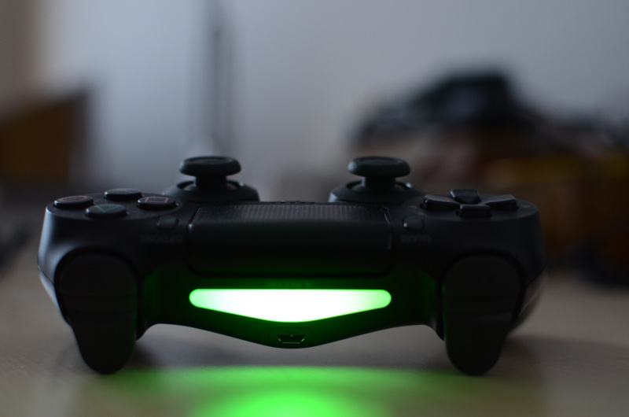
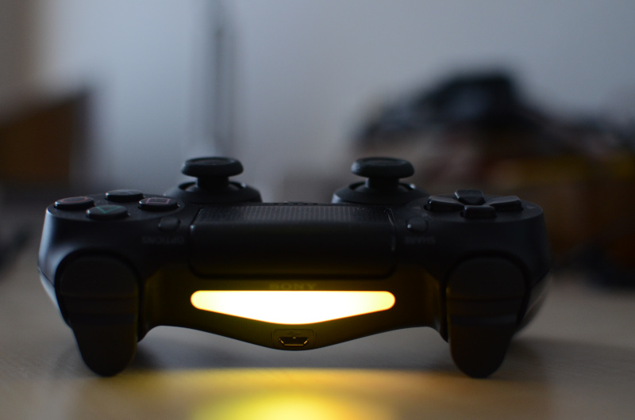
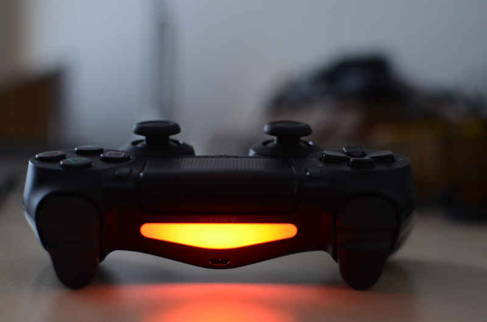

# sony-battery-led daemon

*sony-battery-led* is a small Linux daemon that runs in the background and adjusts the color of the big LED area on Sony game controllers according to their battery status.

It doesn't require any user interaction and supports no configuration. It automatically detects compatible controllers using [UPower](https://upower.freedesktop.org/) and gets notified about charge status changes the same way. It translated the charge information into a continuous color gradient and updates the LED color of the controller using sysfs.

Here is my controller going from fully charged to empty:

  

## Compiling and installing

You'll need a working Rust setup. `cargo build` should work out of the box.

To build the Debian/Ubuntu/... package you'll need cargo-deb. Then run:

    cargo deb --install

That should build, install, and run it. It will automatically be started upon boot as well.

You can also just run it any other way. Beware that the default permissions for the LEDs only allow updates by root. Thus, you either need to run it as root or update the LED permission via a udev rule, or something similar.

## FAQ

### Does it support USB and Bluetooth?

Yes, it should.

### Does it support multiple controllers at the same time?

It should, but I only have one, so I never tried it.

### Does it support other devices than the DualShock 4?

It should support all Sony game controllers that expose battery status and a LED and are supported by the *hid_sony* kernel module. By changing the filter in the source code, it may even support other devices, as long as the LEDs are exposed in the same way in sysfs.

### Does it run on Windows and macOS?

No, and I don't plan on implementing that. Almost 100% of the code is platform-specific, thus it's probably simpler to implement it on other platforms from scratch.

### Can I change the colors, saturation, or brightness?

No, I don't think that's worthwhile. I might be convinced otherwise though.

### Is this project supported, endorsed, or otherwise related to Sony?

No, obviously not.

### Is it any good?

[Yes.](https://news.ycombinator.com/item?id=3067434)
